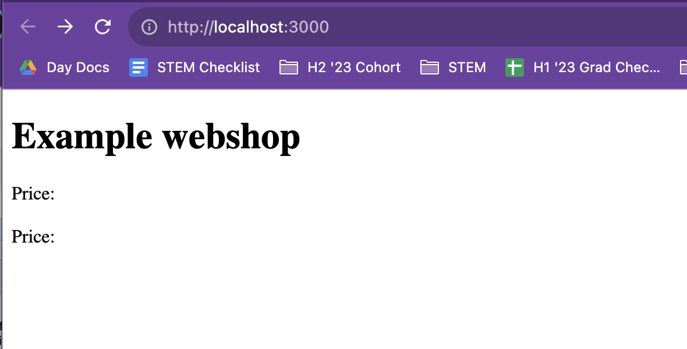
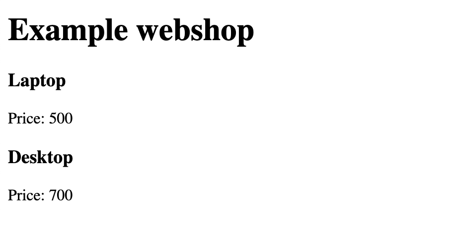

# Week 14 Quiz - Debugging, Git, & GitHub

Thanks for handing me the task. I was able to successfully document and fix bugs and have provided visual references.

### Set Up
```
git clone git@github.com:daaimah123/Week14_Quiz1.git
git remote set-url origin http://github.com/YOU/YOUR_REPO
git push origin main

// start react app
cd client
npm start

// new terminal tab
cd client/server
npm start
```

### Bug Encountered & Fixes
Data from server did not show to client.



The map iterator syntax had the entire `items` array instead of an iterated element of `item` being returned. You could simply add an `s` to the first param, but that wouldn't fit best practice naming conventions.



### Git Commands to Correct file Structure & Remove Node_Modules
```
// move server directory out of the client directory
git mv client/server/ ./server

cd client

// Add the following line to .gitignore dependencies section
**/node_modules

// Remove the node_modules folder from the git repository
git rm -r --cached node_modules

// Add all changed files
git add .

cd ../server

// Add the following line to .gitignore dependencies section
**/node_modules

// Remove the node_modules folder from the git repository
git rm -r --cached node_modules

// Add all changed files
git add .

// Commit the changes to the repo without the node_modules folder
git commit -m "Removed node_modules folder(s)"

// Push the change to the remote repo
git push origin main
```